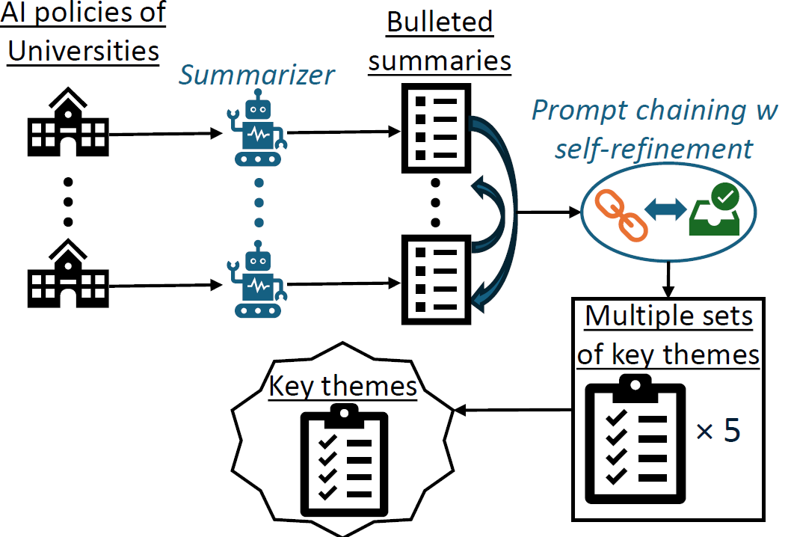

The source code for:

Charles Alba, Wang Xi, Chenyu Wang, and Ruopeng An. 2025. ChatGPT Comes to Campus: Unveiling Core Themes in AI Policies Across U.S. Universities with Large Language Models. In Proceedings of the 56th ACM Technical Symposium on Computer Science Education V. 2 (SIGCSETS 2025). Association for Computing Machinery, New York, NY, USA, 1359–1360. https://doi.org/10.1145/3641555.3705141 


# About

- This study aims to bridge this gap by identifying core themes surrounding AI policies and guidelines across the top 50 U.S. universities.
-  Given the labor- and time-intensive nature required to manually synthesize multiple policy documents across many institutions, we leverage large language models (LLMs) to identify common and prevalent themes.
-  Our framework:  
    - first summarizes AI policies at the institutional level,
    - followed by the generation of multiple sets of themes through an iterative process of prompt chaining and self-refinement.
    - Finally, the common themes from these distinct sets were consolidated.

- This framework is designed to address potential flaws in pre-trained LLMs, such as hallucinations.



# Requirements 

The following packages are required and installed through `pip`

```{bash}
pip install langchain-community openai requests PyPDF2 python-docx pandas tqdm prettytable js2py
```

# Table of Contents
> 1_summarizer  
> 2_theme_identification  
> 3_identifying_final_set_of_common_themes

> results  
>> final_results  
>> interim_results  


`results` contains all the results of our analysis. 
- `final_results` contains the final set of themes identified. 
- `interim_results` contains all results across the intermediate steps leading up to the identification of the final set of themes.

